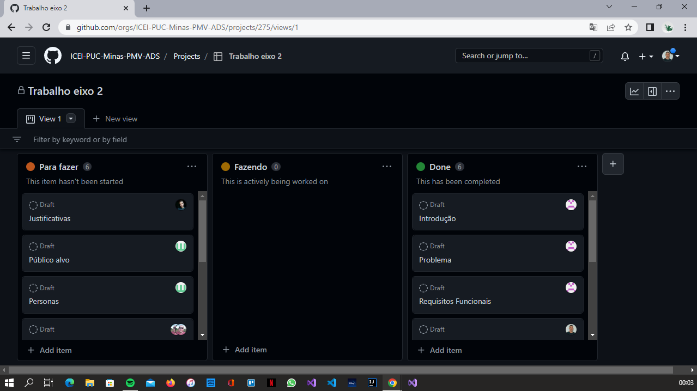

# Metodologia

A metodologia contempla as definições de ferramental utilizado pela equipe tanto para a
manutenção dos códigos e demais artefatos quanto para a organização do time na
execução das tarefas do projeto.

## Relação de Ambientes de Trabalho 

O projeto e seus artefatos são desenvolvidos a partir de algumas plataformas e a relação dos ambientes com seu respectivo propósito é apresentada na tabela a seguir.

|  Abiemnte   | Plataforma  |  Link de Acesso |
|-------|-------------------------|----|
|Repositório de código fonte| GitHub | https://github.com/ICEI-PUC-Minas-PMV-ADS/pmv-ads-2023-1-e2-proj-int-t8-biblioteca | 
|Documentos do projeto| Google Drive |  https://docs.google.com/document/d/1pGcZJ5QLJQ-IaifTZNQ0NhoRgKFXut8dxHcSzkhn_5I/edit | 
|Diagramas| Lucid Chart |  https://www.lucidchart.com/pages/pt | 
|Wireframes| Marvel App |  https://marvelapp.com/ | 
|Gerenciamento do Projeto | Github Projects |  https://github.com/ICEI-PUC-Minas-PMV-ADS/pmv-ads-2023-1-e2-proj-int-t8-biblioteca/projects?query=is%3Aopen| 

## Gestão de código Fonte 
A gestão e manutenção do código fonte é realizado através de branches criadas separadamente da branch principal, evitando previamente qualquer erro/bug no código original. 

A equipe utiliza a seguinte convenção para o nome das Branches : 
* Main : Código fonte, versão estável e já testada do software.
* Feature : Desenvolvendo uma nova funcionalidade ou melhoria.

## Gerenciamento do Projeto 

A equipe utiliza metodologias ágeis, tendo como base para o processo de desenvolvimento o kanban e scrum. 

 O processo consiste nas seguintes etapas : 
* TO DO - Tarefas que ainda não foram iniciadas. 
* DOING - Tarefas que estão em progresso.
* DONE - Tarefas que já foram consluidas.

O quadro kanban está disponível na imagem a seguir :

