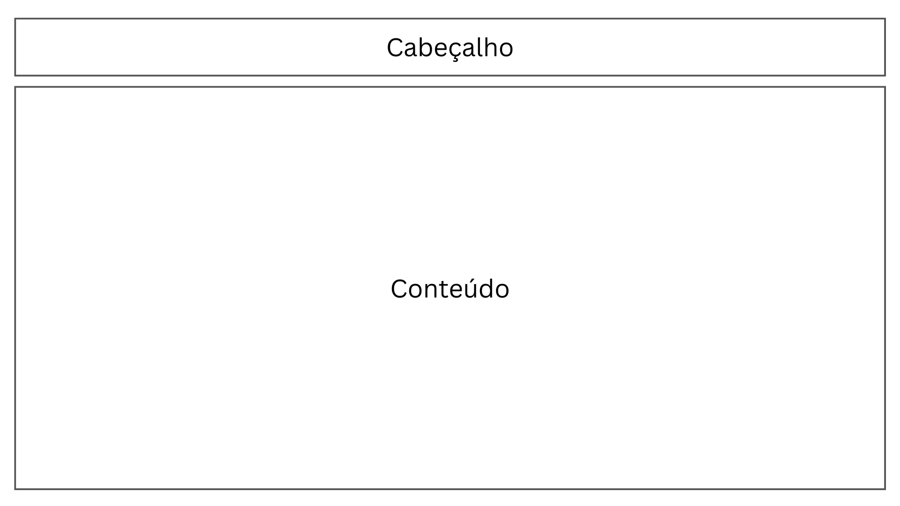
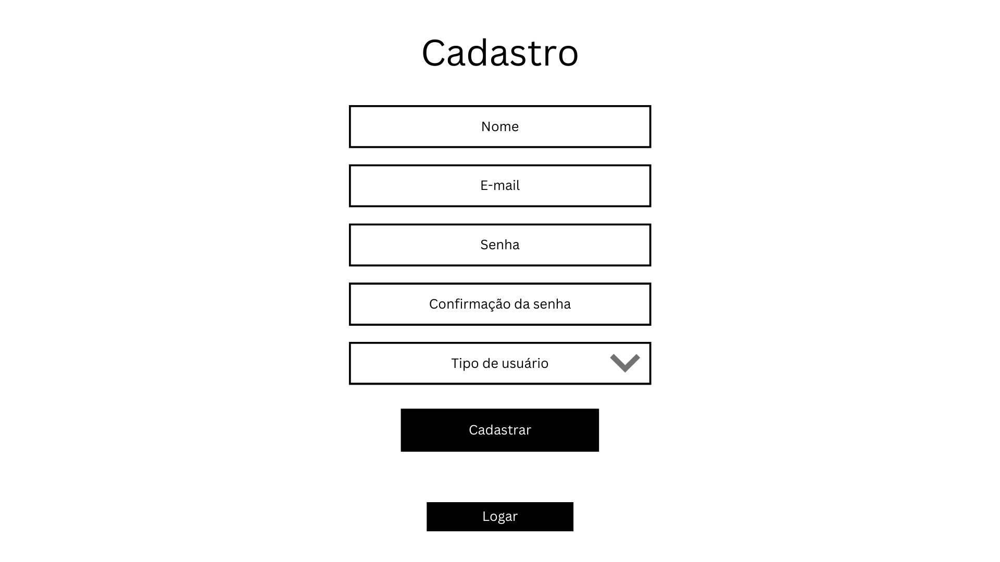
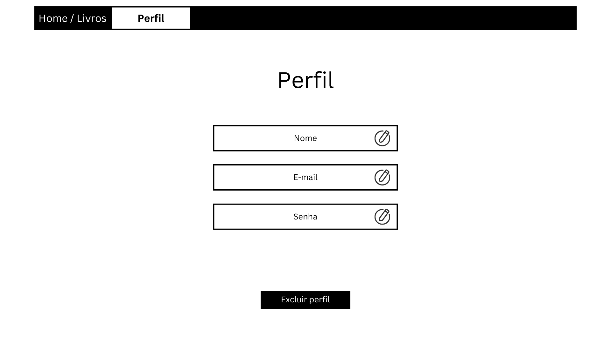

# Projeto de Interface

Dentre as preocupações para a montagem da interface do sistema, estamos estabelecendo foco em questões como agilidade, acessibilidade e usabilidade. Desta forma, o projeto tem uma identidade visual padronizada em todas as telas que são projetadas para funcionamento em desktops.

## Diagrama de Fluxo

## Wireframes

Conforme o diagrama de fluxo do projeto, apresentado no item anterior, as telas do sistema são apresentadas em detalhes nos itens que se seguem. Para visualizar o wireframe interativo, acesse o ambiente MarvelApp do projeto. 

As telas do sistema apresentam uma estrutura comum que é apresentada na Figura X. Nesta estrutura, existem 2 grandes blocos, descritos a seguir. São eles:

- Cabeçalho - local onde são dispostos elementos fixos de identidade (logo) e navegação principal do site (menu da aplicação);
- Conteúdo - apresenta o conteúdo da tela em questão;

### Tela - Login

### Tela - Cadastro

### Tela - Catálogo de livros (Home)

### Tela - Informações do livro

### Tela - Dados do Usuário (Perfil)

